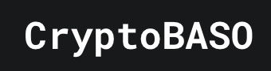

# CryptoBASO: Crypto Buying and Selling Orders 

**Redefine Your Trading Strategy: Combat Frontrunning with Our Game-Changing DEX Solution! Effortlessly Split Swap Orders Across Multiple Transactions on the SKALE Network—Experience Zero Gas Fees, Enhanced Precision, and Unmatched Control Over Your Trades!**

## 🌟 Built With Excellence:

## Inspiration

In the fast-paced world of cryptocurrency trading, our team recognized the significant challenges traders face due to high gas fees and the risk of frontrunning. We saw an opportunity to create a solution that allows users to maximize their trading potential while minimizing costs. Thus, CryptoBASO was born—an innovative DEX solution that leverages the SKALE network's zero gas fees to empower traders like never before.

## What It Does

CryptoBASO assists users in executing split swap orders across multiple transactions on decentralized exchanges (DEXs) without the burden of gas fees. Our platform ensures that traders can take advantage of market opportunities with enhanced control over their orders, all while mitigating losses from frontrunning.

## How We Built It

Our project is built upon a solid foundation, focusing on the following key components:

1. **SKALE Network Integration**: Leveraging SKALE's unique zero gas features to facilitate seamless trading without high fees.
2. **Adaptive DEX Functionality**: Developing a system that intelligently splits swap orders, optimizing execution and minimizing losses.
3. **User Interface**: Creating an intuitive interface that allows users to easily manage their trades and place limit orders on the SKALE network.

## Challenges We Ran Into

- Ensuring that our split transaction mechanism functioned flawlessly across various DEXs.
- Learning to navigate the intricacies of the SKALE network and adapting our solution accordingly.
- Addressing potential MEV (Miner Extractable Value) risks to ensure fair trading practices.

## Accomplishments That We're Proud Of

- Successfully implementing a system that enables efficient split orders without gas fees.
- Enhancing user control over trades by allowing limit orders and minimizing frontrunning risks.
- Creating a user-friendly interface that simplifies the trading process for our users.

## What We Learned

- The intricacies of working with decentralized exchanges and the SKALE network.
- Strategies for minimizing MEV and safeguarding transactions.
- The importance of user experience in designing trading platforms.

## What's Next for CryptoBASO

As the DeFi ecosystem on the SKALE network continues to expand, we aim to enhance our platform by integrating additional features, such as advanced trading tools and personalized user experiences. Our goal is to remain at the forefront of innovation within the SKALE ecosystem, further differentiating our solution and empowering traders.

## 📚 Documentation & Live Demo

Explore our comprehensive documentation and try the live demo to see how CryptoBASO can transform your trading experience.

## 📝 License

CryptoBASO is open-sourced software licensed under the [MIT License](https://opensource.org/licenses/MIT).

---

Crafted with ❤️ by the CryptoBASO Team.

